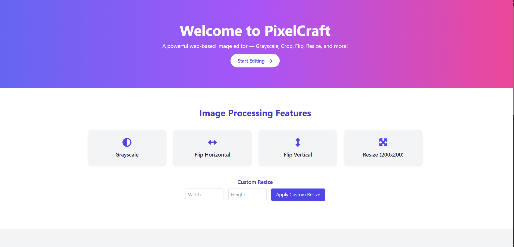

# PixelCraft - Image Editor

PixelCraft is a powerful, web-based image editor built with Flask and Tailwind CSS. It allows users to apply various image editing features such as Grayscale, Crop, Flip (horizontal and vertical), Resize, and more. The project is easy to deploy and customize and comes with a user-friendly interface.


## Features

- **Grayscale**: Convert your image to black and white with a simple click.
- **Flip Horizontal**: Flip the image along the horizontal axis.
- **Flip Vertical**: Flip the image along the vertical axis.
- **Resize**: Resize the image to a custom width and height.
- **Live Image Preview**: See your edited image instantly with live preview functionality.
- **Download Image**: After editing, download the modified image.

## Frontend Overview
 
The frontend of PixelCraft is designed with simplicity and usability in mind. Below is a preview of the interface:



## Tech Stack

| **Technology**      | **Purpose**                                      | **Symbol**                         |
|---------------------|--------------------------------------------------|------------------------------------|
| **Flask**           | Web framework for backend (Python)               |  |
| **Python**          | Backend programming language                     |  |
| **Tailwind CSS**    | Utility-first CSS framework for responsive design|  |
| **Font Awesome**    | Icon library for front-end UI                    |  |
| **Pillow**          | Python Imaging Library for image processing      |  |
| **OpenCV**          | Computer vision library for image processing     |  |
| **NumPy**           | Library for numerical computing in Python        |  |
| **HTML**            | Markup language for web content                  |  |
| **CSS**             | Styling language for web pages                   |  |

## Installation

### 1. Clone the repository
```bash
git clone https://github.com/yourusername/PixelCraft.git
cd PixelCraft
```

### 2. Install dependencies
```bash
pip install -r requirements.txt
```

### 3. Run the application locally
```bash
python app.py
```

The application will be available at `http://127.0.0.1:5000`.

---

## Deployment on Render

You can deploy PixelCraft on **Render** by following these steps:

### 1. Create a Render Account
- Go to [Render](https://render.com) and create an account if you don’t already have one.

### 2. Create a New Web Service
- Click on **New** > **Web Service**.
- Connect your GitHub repository containing the PixelCraft project.

### 3. Configure the Service
- **Build Command**: Leave it empty (Render will automatically detect Python projects).
- **Start Command**: Use the following:
  ```bash
  gunicorn app:app
  ```
- **Environment**: Select `Python 3.x`.

### 4. Deploy
- Click **Create Web Service**.
- Render will automatically build and deploy your application.

### 5. Access Your Application
Once deployed, Render will provide you with a live URL (e.g., `https://pixelcraft.onrender.com`). Open the URL in your browser to access the application.

---

## Contributing

Contributions are welcome! Feel free to open an issue or submit a pull request.

---

## License

This project is licensed under the MIT License. See the `LICENSE` file for details.